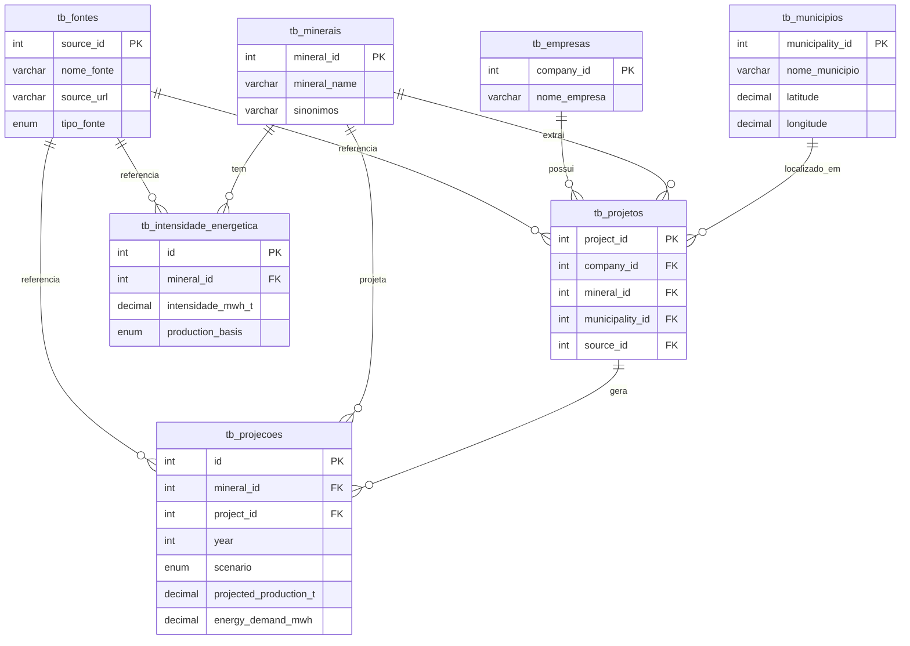

```mermaid
erDiagram
    tb_fontes ||--o{ tb_projetos : referencia
    tb_fontes ||--o{ tb_intensidade_energetica : referencia
    tb_fontes ||--o{ tb_projecoes : referencia
    tb_empresas ||--o{ tb_projetos : possui
    tb_minerais ||--o{ tb_projetos : extrai
    tb_minerais ||--o{ tb_intensidade_energetica : tem
    tb_minerais ||--o{ tb_projecoes : projeta
    tb_municipios ||--o{ tb_projetos : localizado_em
    tb_projetos ||--o{ tb_projecoes : gera

    tb_fontes {
        int source_id PK
        varchar nome_fonte
        varchar source_url
        enum tipo_fonte
    }
    tb_municipios {
        int municipality_id PK
        varchar nome_municipio
        decimal latitude
        decimal longitude
    }
    tb_minerais {
        int mineral_id PK
        varchar mineral_name
        varchar sinonimos
    }
    tb_empresas {
        int company_id PK
        varchar nome_empresa
    }
    tb_projetos {
        int project_id PK
        int company_id FK
        int mineral_id FK
        int municipality_id FK
        int source_id FK
    }
    tb_intensidade_energetica {
        int id PK
        int mineral_id FK
        decimal intensidade_mwh_t
        enum production_basis
    }
    tb_projecoes {
        int id PK
        int mineral_id FK
        int project_id FK
        int year
        enum scenario
        decimal projected_production_t
        decimal energy_demand_mwh
    }
```
