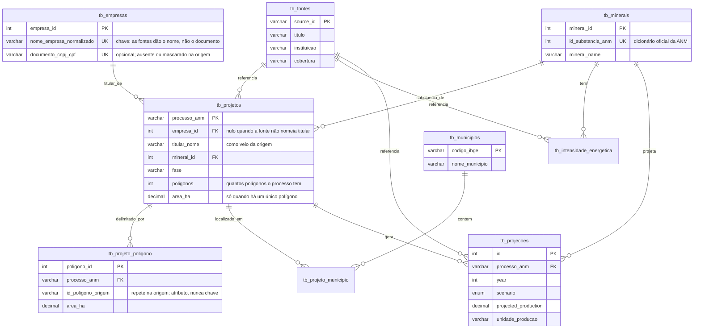

# Modelo entidade-relacionamento

Atualizado em 13/09/2026, junto com a migração `001_titular_sem_documento.sql`.

## Três decisões que o diagrama registra

**A empresa é chaveada pelo nome normalizado.** O shapefile cadastral traz o titular só pelo nome, e o CSV de rodadas traz CPF/CNPJ mascarado. Exigir documento obrigaria a inventá-lo para carregar qualquer linha real.

**Polígono tem tabela própria.** Um processo pode ter mais de cem polígonos. Usar o processo como chave única descartaria 772 das 17.428 linhas do shapefile de Goiás.

**`area_ha` do processo só é preenchida com um único polígono.** Polígonos podem se sobrepor, então somá-los produziria superfície inexistente. Com vários, a área fica em `tb_projeto_poligono` e o total não é declarado.
